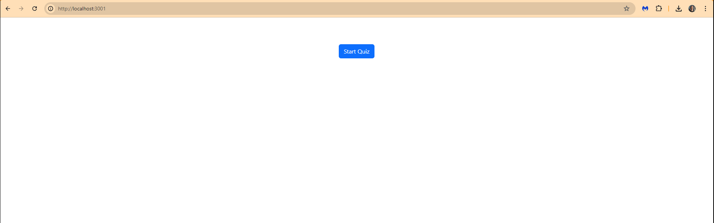

# Challenge-19 (Cypress Testing)

## Introduction

[](https://opensource.org/licenses/MIT)
[](https://github.com/ellerbrock/typescript-badges/)


## Table of Contents

- [Required-Technologies](#required-technologies)
- [Installation](#installation)
- [Usage](#usage)
- [Code Snippet](#code-snippet)
- [Screenshots](#screenshots)
- [Features](#features)
- [Future-Features](#future-features)
- [License](#license)
- [Technologies](#technologies-used)

## Required Technologies

This project requires node.js and its included node package manager.\
You can go to <a href="https://nodejs.org/en/download/package-manager">this</a> website to download node.js and npm. Just follow node's included download instructions!

MongoDB is also required to use this Project. You can follow <a href="https://www.mongodb.com/">this</a> to go to mongoDB's main site. Just follow their instructions on how to install mongoDB onto your system.

## Installation

Once the files are downloaded onto your machine open the project folder and run the terminal in the root directory.
To install the necessary dependencies run the "npm i" and the "npm run install" command to install the required files.

Once you have installed the needed dependencies navigate to the server folder and remove the ".EXAMPLE" extension from the .env.EXAMPLE file and save. Then run the "npm run seed" command to seed the database to ensure that the quiz has questions.

To start the application first run "npm run build" to build the server and client and then do "npm run start:dev" to run the server and the client. A list of extra commands is provided in the "package.json" file for additional commands.

## Usage

Once the site is started youll be greeted by its home page which is just a button to start the quiz. Once clicked on the quiz will start and the page will change. A question and 4 answers pertaining to that quesiton will be displayed on each page. Clicking on an answer will submit it and the next question will be displayed. Once finished youll be greeted by your score letting you know how well you did and a button to restart the quiz.

For this assignment we were asked to design tests using cypress to test the various features of this quiz. Once the server and page have started, in a seperate terminal you can run "npm run test" (to run tests within the terminal) or "npm run cypress" (to run tests within the cypress gui). Personally I would run "npm run cypress" for clairity but the choice is yours. By running the userJourney.cy.js e2e test within the cypress gui various tests will run.

The tests themselves check the functionality of the start test button, check that new questions are displayed upon clicking an answer, check that after all questions are answered the quiz displays the quiz finish page, check that the score displays on the results screen, and check that the quiz restarts when the restart button is clicked.

All of these tests should come out true. If there are issues with getting cypress to run or that tests arent coming out true then check that everything is installed correctly.

## Code Snippet

This piece of code is what checks that when all questions are answered that the final page displays. All it does is click the start button. click the first answer of every question 10 times. Then finally checks that the test saying "Quiz Complete" is displayed on the final page.

```
it("When all questions are answered then the quiz is over.", () => {
    //click the quiz start button
    cy.get("div button").click();

    for (let x = 0; x < 10; x++) {
      //click the quiz question button
      cy.get("div button").eq(0).click();
    }

    //Check that the quiz completed text is on the page signifiying that we have finished the quiz
    cy.get("div h2").invoke("text").should("equal", "Quiz Completed");
  });
```

## Screenshots

#### This is a gif that shows the quiz itself.



## Features

Features include:

- Test features
- Start quiz
- Answer questions
- Get score
- Restart quiz

## Future Features

Personally to me their is not much i can say should be added to this assignment. It does what it needs to do. In the future it may be maintained but as it is right now it is feature complete.

## License

Licensed under the MIT license.

## Technologies Used

<ul>
<li>Stack Overflow (For specific mongoose issues and ideas)</li>
<li>Node.js (for installing packages as well as building and running code).</li>
<li>Visual Studio Code (for writing code).</li>
<li>Mozila Web Docs and W3 Schools (for getting help with TypeScript).</li>
</ul>

